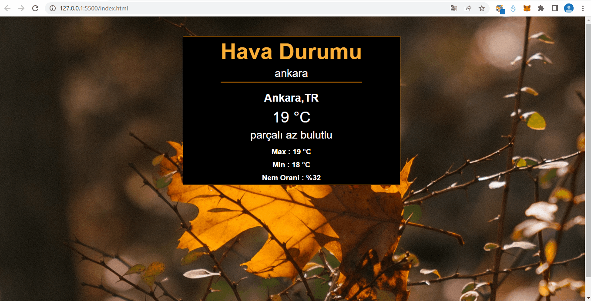

<h3>Real-time Weather Application</h3>

This is a real-time weather application developed using HTML, CSS, and JavaScript. It allows users to search for the weather conditions of any city around the world and get the current weather, temperature, humidity, and wind speed.

<h3>Technologies Used</h3>

HTML - CSS - JavaScript - OpenWeatherMap API

